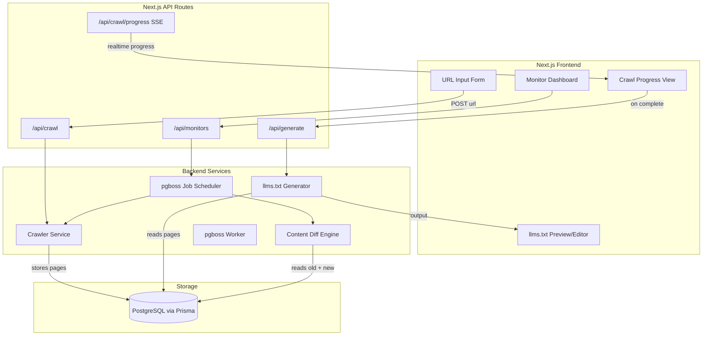
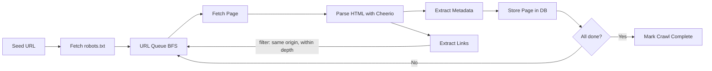

# llms.txt Generator -- Design Document

## 1. Problem Statement

Website owners and developers increasingly need to provide LLM-friendly representations of their sites. Manually creating and maintaining an `llms.txt` file is tedious: you need to identify the most important pages, write concise descriptions, organize them into logical sections, and keep it all up to date as the site evolves.

This tool automates the entire lifecycle -- crawl, generate, and monitor -- through a single web interface.

## 2. High-Level Architecture




## 3. Tech Stack

- **Framework**: Next.js 14+ (App Router)
- **Language**: TypeScript
- **Database**: PostgreSQL via Prisma ORM
- **Job Queue**: `pgboss` (Postgres-backed job queue for scheduling and background work)
- **Crawling**: `cheerio` for HTML parsing, `robots-parser` for robots.txt compliance
- **HTTP**: `undici` or native `fetch` for requests
- **Real-time**: Server-Sent Events (SSE) for crawl progress
- **Styling**: Tailwind CSS + shadcn/ui components
- **State**: React Query (TanStack Query) for server state

## 4. Data Model

```prisma
model Site {
  id          String    @id @default(cuid())
  url         String    @unique
  name        String?
  description String?
  createdAt   DateTime  @default(now())
  updatedAt   DateTime  @updatedAt
  crawls      Crawl[]
  monitors    Monitor[]
}

model Crawl {
  id          String     @id @default(cuid())
  siteId      String
  site        Site       @relation(fields: [siteId], references: [id])
  status      String     // pending | running | completed | failed
  pagesFound  Int        @default(0)
  startedAt   DateTime   @default(now())
  completedAt DateTime?
  llmsTxt     String?    // generated output
  pages       Page[]
}

model Page {
  id          String   @id @default(cuid())
  crawlId     String
  crawl       Crawl    @relation(fields: [crawlId], references: [id])
  url         String
  title       String?
  description String?
  contentHash String?  // for change detection
  depth       Int      @default(0)
  section     String?  // inferred section grouping
  importance  Float    @default(0) // ranking score
  statusCode  Int?
  crawledAt   DateTime @default(now())
}

model Monitor {
  id          String   @id @default(cuid())
  siteId      String
  site        Site     @relation(fields: [siteId], references: [id])
  active      Boolean  @default(true)
  interval    String   @default("daily") // hourly | daily | weekly
  lastCheckAt DateTime?
  lastChangeAt DateTime?
  webhookUrl  String?  // optional notification endpoint
}
```

## 5. Core Modules

### 5.1 Crawler Service (`lib/crawler/`)

Responsible for traversing a site, respecting robots.txt, and extracting page metadata.

**Design decisions:**

- **Breadth-first traversal** with configurable max depth (default: 3) and max pages (default: 200)
- **Concurrency**: Pool of 5 concurrent requests with per-domain rate limiting (1 req/sec)
- **Scope**: Only follows links within the same origin domain
- **Extraction per page**: `<title>`, `<meta name="description">`, `<h1>`, Open Graph tags, canonical URL
- **Content hashing**: SHA-256 of the extracted text content (for change detection later)
- **robots.txt**: Fetched once at crawl start, respected throughout

**Crawl flow:**




### 5.2 llms.txt Generator (`lib/generator/`)

Transforms crawled pages into a spec-compliant llms.txt file.

**Section classification strategy:**

Pages are grouped into sections using a heuristic pipeline:

1. **URL path segmentation**: `/docs/foo` -> "Docs", `/blog/bar` -> "Blog", `/api/baz` -> "API"
2. **Common patterns**: Map well-known prefixes to canonical section names (e.g., `/pricing`, `/about`, `/faq`)
3. **Fallback**: Pages that don't fit a pattern go into a general section

**Importance scoring** (determines which pages make the cut and ordering):

- Homepage = 1.0
- Depth 1 pages = 0.8, depth 2 = 0.5, depth 3 = 0.3
- Bonus for pages linked from the homepage (+0.2)
- Bonus for pages with complete metadata (title + description) (+0.1)
- Pages below a threshold (0.2) are placed in the "Optional" section per spec

**Output format** follows the spec exactly:

```markdown
# {Site Name}

> {Site description from homepage meta}

{Brief context paragraph derived from homepage content}

## {Section Name}

- [{Page Title}]({URL}): {Description}

## Optional

- [{Lower-priority page}]({URL}): {Description}
```

### 5.3 Change Monitor (`lib/monitor/`)

Detects structural and content changes by periodically re-crawling monitored sites.

**How it works:**

1. `pgboss` triggers a check based on the configured interval (using its native cron scheduling)
2. A fresh crawl is performed (same logic as initial crawl)
3. The **Diff Engine** compares old vs. new crawl:
  - **Added pages**: New URLs not in previous crawl
  - **Removed pages**: Old URLs missing from new crawl
  - **Modified pages**: Same URL but different `contentHash`
4. If any changes are detected:
  - A new llms.txt is generated
  - The diff summary is stored
  - Optional webhook notification is sent
5. If no changes, only `lastCheckAt` is updated

**Diff detection** is based on the `contentHash` (SHA-256 of extracted text), so cosmetic HTML changes that don't affect content are ignored.

## 6. API Routes


| Route                      | Method       | Purpose                         |
| -------------------------- | ------------ | ------------------------------- |
| `/api/sites`               | GET          | List all tracked sites          |
| `/api/crawl`               | POST         | Start a new crawl for a URL     |
| `/api/crawl/[id]`          | GET          | Get crawl status and results    |
| `/api/crawl/[id]/progress` | GET (SSE)    | Stream real-time crawl progress |
| `/api/generate/[crawlId]`  | POST         | Generate llms.txt from a crawl  |
| `/api/monitors`            | GET/POST     | List or create monitors         |
| `/api/monitors/[id]`       | PATCH/DELETE | Update or remove a monitor      |


## 7. User Experience

### 7.1 Page: Home / Generate

The primary screen. A single centered input field with a "Generate" button. The flow after submission:

1. **Crawling phase**: A live progress panel appears showing pages discovered in real time (via SSE). Each page shows its title and URL as it's found. A progress indicator shows pages crawled / estimated total.
2. **Generation phase**: Brief processing step after crawl completes. Automatic.
3. **Result phase**: The generated llms.txt is displayed in a syntax-highlighted Markdown preview panel. The user can:
  - **Copy** the full text to clipboard
  - **Download** as a file
  - **Edit** sections inline (reorder, rename sections, remove pages, tweak descriptions)
  - **Set up monitoring** for this site with one click

### 7.2 Page: Dashboard

Shows all previously generated sites as cards:

- Site name, URL, last crawl date
- Monitor status (active/inactive, last check, changes detected)
- Quick actions: re-crawl, view latest llms.txt, edit monitor settings

### 7.3 Page: Monitor Detail

Shows the change history for a monitored site:

- Timeline of checks with diff summaries
- Side-by-side comparison of old vs. new llms.txt when changes occur
- Controls for interval, enable/disable, webhook URL

## 8. Project Structure

```
profound/
  prisma/
    schema.prisma
  src/
    app/
      page.tsx                    # Home / URL input
      dashboard/
        page.tsx                  # All sites overview
      site/[id]/
        page.tsx                  # Site detail + monitor
      api/
        sites/route.ts
        crawl/route.ts
        crawl/[id]/route.ts
        crawl/[id]/progress/route.ts   # SSE endpoint
        generate/[crawlId]/route.ts
        monitors/route.ts
        monitors/[id]/route.ts
    lib/
      crawler/
        index.ts                 # Main crawl orchestrator
        fetcher.ts               # HTTP fetch with rate limiting
        parser.ts                # HTML parsing + metadata extraction
        robots.ts                # robots.txt handling
      generator/
        index.ts                 # llms.txt generation pipeline
        classifier.ts            # Section classification
        scorer.ts                # Page importance scoring
        formatter.ts             # Markdown output formatting
      monitor/
        scheduler.ts             # pgboss job queue setup and scheduling
        diff.ts                  # Content diff engine
        notifier.ts              # Webhook notifications
      jobs/
        worker.ts                # pgboss worker that processes crawl + monitor jobs
        queues.ts                # Job queue names and type definitions
      db.ts                      # Prisma client singleton
    components/
      url-input.tsx
      crawl-progress.tsx
      llms-preview.tsx
      site-card.tsx
      monitor-controls.tsx
```

## 9. Key Design Decisions and Trade-offs

- **Cheerio over Playwright**: Cheerio is fast, lightweight, and sufficient for extracting metadata from server-rendered HTML. Sites that are fully client-side rendered (SPAs) will yield poor results. This is an acceptable trade-off for v1; Playwright support can be added later as an opt-in "deep crawl" mode.
- **PostgreSQL + pgboss**: Postgres serves as both the application database and the job queue backend (via pgboss). This avoids introducing a separate Redis dependency for scheduling while giving us durable, transactional job processing with built-in cron scheduling, retries, and dead-letter handling. Local dev uses a Postgres container via Docker Compose.
- **SSE over WebSockets**: Simpler to implement in Next.js API routes, one-directional (server-to-client) which is all we need for progress updates. No additional infrastructure required.
- **Heuristic section classification**: Rather than using an LLM to classify pages (which would add latency, cost, and an external dependency), we use URL path patterns and metadata. This is fast, deterministic, and free. An LLM-powered "smart classification" mode could be added as a premium feature later.

## 10. Future Enhancements (Out of Scope for v1)

- **LLM-assisted descriptions**: Use an LLM to summarize page content for better link descriptions
- **Playwright deep crawl mode**: For JavaScript-heavy SPAs
- **Authentication support**: Crawl sites behind login
- **Markdown page generation**: Generate `.md` versions of pages (the companion spec to llms.txt)
- **Multi-user / auth**: If deployed as a shared service
- **Export to PR**: Generate a PR directly to add llms.txt to a repo

